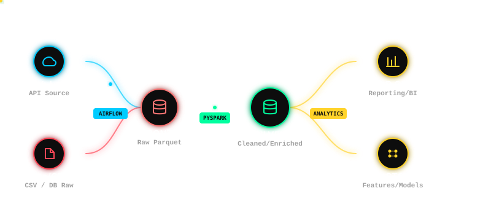

<div align="center">

<!-- HEADER BANNER -->


<!-- TYPING ANIMATION -->
<a href="https://git.io/typing-svg">
  
</a>

<br/>

<!-- BADGE ROW -->


</div>

---

<!-- ABOUT ME -->
<div align="center">
<h2>⚡ <span style="color:#00ff9f">WHO AM I?</span></h2>
</div>

```python
class Siddharth:
    def __init__(self):
        self.name        = "Siddharth T"
        self.role        = ["AI & DS Engineer", "Full-Stack Dev", "Data Architect"]
        self.location    = "Kulithalai, Karur, Tamil Nadu 🇮🇳"
        self.education   = "B.Tech AI & Data Science @ J.J. College of Engineering"
        self.cgpa        = 8.05
        self.portfolio   = "https://airox.co.in/Siddharth-portfolio"

    def current_focus(self):
        return [
            "🔭 Building end-to-end Data Engineering pipelines",
            "🧠 Exploring LLM integrations & AI-powered apps",
            "📦 Mastering Docker, Apache Airflow & PySpark",
            "🌱 Deep-diving into MLOps & real-time streaming",
        ]

    def fun_fact(self):
        return "I presented AI research at a national conference as a 1st year student 🎤"

me = Siddharth()
```

<br/>

<table align="center">
<tr>
<td>

- 🎓 Pursuing **B.Tech in AI & Data Science** (CGPA: 8.05)
- 🔬 Research presenter at **ICAIDSC 2024**
- 🛠️ Built a full Medallion Architecture data platform with **PySpark + Airflow**
- 🌐 Deployed production portals used by an entire department
- 🎯 Goal: **Scalable, AI-driven data systems that actually ship**
- ⚡ Fun fact: I run my own domain **airox.co.in** as a personal dev lab

</td>
</tr>
</table>

---

<!-- TECH STACK -->
<div align="center">
<h2>🛸 TECH ARSENAL</h2>
</div>

<div align="center">

**Languages**


<br/><br/>

**AI & Data Science**


<br/><br/>

**Frameworks & Libraries**


<br/><br/>

**Databases & Storage**


<br/><br/>

**DevOps & Infrastructure**


<br/><br/>

**Tools & Environments**


<br/><br/>

**Architecture & Concepts**


</div>

---

<!-- FEATURED PROJECTS -->
<div align="center">
<h2>🚀 FEATURED PROJECTS</h2>
</div>

<table align="center">

<tr>
<td width="50%" valign="top">

### 🏭 Telecom Complaint Data Platform
> *Enterprise-grade data engineering — built from scratch*

[](https://github.com/siddharth99520/YOUR-REPO-NAME)

<p align="center">
  
</p>

```
Architecture : Medallion (Bronze → Silver)
Processing   : PySpark distributed engine
Orchestration: Apache Airflow DAGs
Environment  : Fully containerized via Docker
```

**What it does:**
- Ingests raw telecom complaint records into Bronze layer
- Cleans, transforms & enriches data into Silver layer
- Orchestrated with automated DAG-based scheduling
- Isolated containerized environments for reproducibility

**Stack:** `PySpark` `Apache Airflow` `Docker` `Medallion Architecture`

</td>
<td width="50%" valign="top">

### 🎓 AI & DS Department Portal
> *Full-stack academic management system*

[](https://github.com/siddharth99520/YOUR-REPO-NAME)
[](https://airox.co.in/ai-ds)

```
Frontend  : Glassmorphism UI / HTML / CSS
Backend   : PHP + MySQL
Auth      : Role-based access control
Features  : Real-time academic tracking
```

**What it does:**
- Multi-role dashboards: Student / Staff / Admin
- Real-time attendance & academic tracking
- Modern glassmorphism UI design
- Secure role-based authentication

**Stack:** `PHP` `MySQL` `HTML/CSS` `RBAC`

</td>
</tr>

<tr>
<td width="50%" valign="top">

### 🌐 Symposium Event Website
> *High-traffic event management platform*

[](https://github.com/siddharth99520/YOUR-REPO-NAME)
[](https://airox.co.in)

```
Platform  : WordPress + Elementor
DNS/CDN   : Cloudflare
Uptime    : Stable under registration spikes
Design    : Responsive, mobile-first
```

**What it does:**
- Responsive event management portal
- Cloudflare DNS for security & scalability
- Handled high-traffic student registrations
- Clean, modern UI with full mobile support

**Stack:** `WordPress` `Elementor` `Cloudflare` `DNS`

</td>
<td width="50%" valign="top">

### 🧠 PTH-Net — AI Research
> *Facial Expression Recognition — ICAIDSC 2024*

[](https://github.com/siddharth99520/YOUR-REPO-NAME)

```
Domain    : Computer Vision / Deep Learning
Focus     : Temporal Hierarchy Networks
Venue     : Indira Ganesan College of Eng.
Type      : Oral Presentation
```

**What it's about:**
- Context-Aware Temporal Hierarchy model
- Robust Dynamic Facial Expression Recognition
- Presented findings to national research audience
- Explored attention mechanisms in video data

**Stack:** `Deep Learning` `Computer Vision` `Python`

</td>
</tr>

</table>

---

<!-- GITHUB STATS -->
<div align="center">
<h2>📊 GITHUB STATS & ACTIVITY</h2>
</div>

<div align="center">


<br/><br/>


</div>

<br/>

<!-- TROPHIES -->
<div align="center">


</div>

<br/>

<!-- ACTIVITY GRAPH -->
<div align="center">


</div>

---

<!-- EDUCATION & CERTIFICATIONS -->
<div align="center">
<h2>🎓 EDUCATION & CERTIFICATIONS</h2>
</div>

<table align="center">
<tr>
<td align="center" width="33%">

**🏛️ B.Tech**
AI & Data Science
J.J. College of Engineering
Trichy | Aug 2024 – Present
`CGPA: 8.05`

</td>
<td align="center" width="33%">

**📜 Diploma**
Computer Engineering
Kongunadu Polytechnic College
2023 | `87%`

</td>
<td align="center" width="33%">

**🎤 Research**
ICAIDSC 2024
Oral Presentation
Indira Ganesan College of Eng.
`PTH-Net Paper`

</td>
</tr>
</table>

---

<!-- CURRENT FOCUS -->
<div align="center">
<h2>🔭 CURRENT FOCUS</h2>
</div>

```bash
$ cat current_status.log

[ACTIVE]   🏗️  Expanding the Telecom Data Platform with Gold layer
[ACTIVE]   🤖  Exploring LLM integrations & prompt engineering
[LEARNING] ☁️  Cloud platforms (AWS / GCP) for data workloads
[LEARNING] 📊  Real-time streaming with Apache Kafka
[EXPLORING]🦾  MLOps lifecycle management & model deployment
[BUILDING] 🌐  Expanding airox.co.in into a full developer ecosystem
```

---

<!-- SNAKE CONTRIBUTION ANIMATION -->
<div align="center">
<h2>🐍 CONTRIBUTION SNAKE</h2>

<picture>
  <source media="(prefers-color-scheme: dark)" srcset="https://raw.githubusercontent.com/siddharth99520/siddharth99520/output/github-contribution-grid-snake-dark.svg" />
  <source media="(prefers-color-scheme: light)" srcset="https://raw.githubusercontent.com/siddharth99520/siddharth99520/output/github-contribution-grid-snake.svg" />
  
</picture>

</div>

---

<!-- RANDOM DEV QUOTE -->
<div align="center">
<h2>💬 DEV QUOTE OF THE DAY</h2>


</div>

---

<!-- CONTACT -->
<div align="center">
<h2>📡 CONNECT WITH ME</h2>

<a href="mailto:siddharthtamilselvan1@gmail.com">
  
</a>
<a href="https://airox.co.in/Siddharth-portfolio">
  
</a>
<a href="https://github.com/siddharth99520">
  
</a>
<a href="https://linkedin.com/in/siddharth-t">
  
</a>


<br/><br/>

> 💼 **Open to:** Data Engineering roles, AI/ML internships, Full-Stack projects, Research collaborations
>
> 📍 **Based in:** Kulithalai, Karur, Tamil Nadu, India

</div>

---

<!-- FOOTER -->


<div align="center">

*"Data is the new oil — I build the refinery."*

</div>
